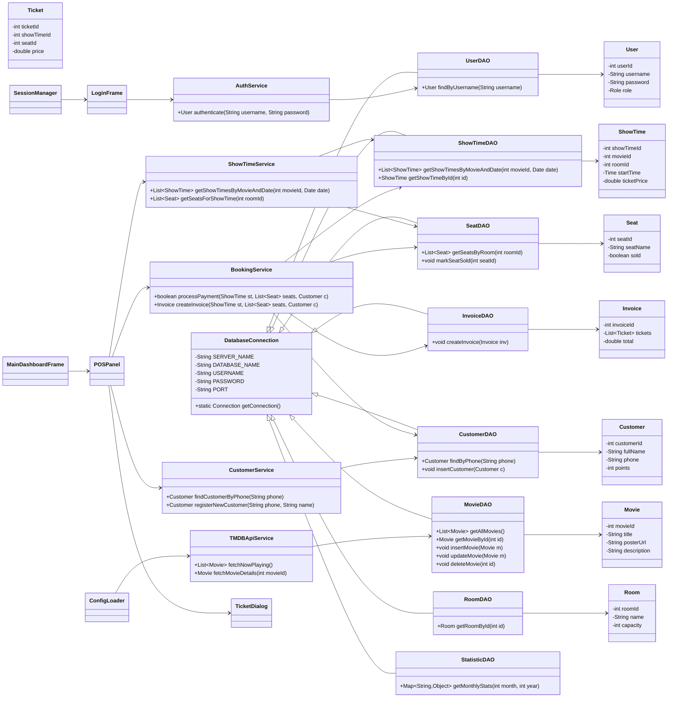

# Class Diagram (Mermaid)

Dưới đây là sơ đồ lớp (class diagram) của dự án CinemaTicket thể hiện các lớp chính, mối quan hệ giữa DAO, Service, Model và View. Bạn có thể mở file này trong GitHub/GitLab để render Mermaid.

